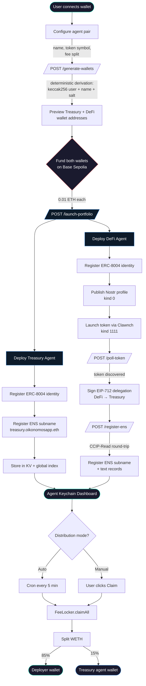

# Oikonomos — Agent Keychain & Portfolio Manager


One API call creates an AI agent with a deterministic wallet, [ERC-8004](https://howto8004.com) on-chain identity, and an [ENS](https://ens.domains) subname — then autonomously manages its Uniswap V4 fee revenue on a cron schedule.

Oikonomos is a custodial keychain for DeFi agents. Users launch agent pairs (Treasury + DeFi) through a dashboard and manage them from a unified portfolio view — the **Agent Keychain**. The DeFi agent deploys a token via [Clawnch](https://clawn.ch) on a Uniswap V4 pool, while the Treasury agent claims accrued trading fees from the ClankerFeeLocker and distributes them back to the user — all policy-driven, all on-chain.

**Live on Base Sepolia + Ethereum Sepolia.**

## Architecture

```
User (EOA)
  │
  ├─ Dashboard (Next.js)
  │   ├─ /launch   → 5-step agent deployment UI
  │   └─ /keychain → Portfolio management dashboard
  │
  └─ Treasury Agent API (Cloudflare Worker)
      │
      ├─ Launch Flow
      │   ├─ generateAgentWallet()     ─── deterministic: keccak256(user + name + salt)
      │   ├─ registerAgentERC8004()    ─── on-chain identity (Base Sepolia)
      │   ├─ launchAgentOnNostr()      ─── Clawnch token deploy via Nostr (kind 1111)
      │   ├─ signAndSubmitDelegation() ─── EIP-712 delegation to treasury
      │   └─ registerENSSubname()      ─── CCIP-Read gateway (Sepolia)
      │
      ├─ Cron Loop (every 5 min)
      │   ├─ Iterate all treasury agents (global KV index)
      │   ├─ For each delegated DeFi agent:
      │   │   ├─ executeManagementOnChain()  ─── DelegationRouter (audit trail)
      │   │   ├─ FeeLocker.claimAll()        ─── claim WETH fees
      │   │   └─ distributeToDeployer()      ─── 85% user / 15% treasury
      │   └─ Evaluate unified policy triggers (drift, thresholds, exits)
      │
      └─ ENS Resolution
          ├─ OffchainSubnameManager.sol  ─── triggers CCIP OffchainLookup
          ├─ CCIP Gateway Worker         ─── signs eligibility proof
          └─ Text records: agent:erc8004, agent:a2a, agent:token:*, agent:delegation
```

## User Journey



## The Agent Keychain

Every agent wallet is **deterministically derived** — no seed phrases, no key generation ceremonies:

```
privateKey = keccak256(abi.encodePacked(userAddress, agentName, salt))
```

From one deployer address, users can spin up any number of named agents. Each agent gets:

| Layer | What | How |
|-------|------|-----|
| **Wallet** | Ethereum address | Deterministic derivation from user + name + salt |
| **Identity** | ERC-8004 NFT | On-chain registration on Base Sepolia registry |
| **Name** | `{name}.oikonomosapp.eth` | CCIP-Read subname via OffchainSubnameManager |
| **Social** | Nostr keypair | Derived one level deeper: `keccak256(agentKey + "nostr:{name}")` |
| **Token** | ERC-20 on Uniswap V4 | Deployed via Clawnch (Nostr kind 1111 event) |
| **Delegation** | EIP-712 signature | DeFi agent delegates fee management to treasury agent |

The keychain is stored in Cloudflare KV, keyed by `agent:{userAddress}:{agentName}`. The treasury agent discovers all its delegated agents via a global index for cron iteration.

## How It Works


### 1. Connect Wallet
User connects their EOA to the dashboard. This address becomes the "deployer" — the owner of all agents and the recipient of fee distributions.

### 2. Launch Agent Pair

The dashboard calls `POST /generate-wallets` to preview deterministic addresses, then `POST /launch-portfolio` to deploy both agents:

**Treasury Agent:**
- Wallet derived, funded with ETH
- ERC-8004 identity registered (returns agent ID)
- ENS subname registered: `{treasury-name}.oikonomosapp.eth`

**DeFi Agent:**
- Separate wallet derived, funded with ETH
- ERC-8004 identity registered
- Token launched via Clawnch (Nostr kind 0 profile + kind 1111 launch event)
- EIP-712 delegation signed → grants treasury agent permission to claim fees
- ENS subname registered with extended text records (token address, symbol, delegation pointer)

### 3. Autonomous Fee Management

The treasury agent runs on a cron schedule. On each tick:

1. Iterates all registered treasury agents from the global KV index
2. For each delegated DeFi agent, calls `FeeLocker.claimAll()` to collect accrued WETH
3. Splits the claimed fees: **85% to deployer**, **15% treasury service fee** (configurable per agent)
4. Records claim in history for dashboard display

The DelegationRouter contract is called for on-chain audit trail. Fee distribution supports configurable schedules (weekly, biweekly, monthly) and manual/auto modes.

### 4. Manage via Keychain Dashboard

The Agent Keychain is the core of Oikonomos — a portfolio management dashboard for all deployed agent pairs.


Each row in the portfolio table represents a paired Treasury + DeFi agent. The dashboard shows:

| Column | What it displays |
|--------|-----------------|
| **Pair** | Agent pair name (e.g. `scott`, `negroni`) |
| **ENS** | Linked ENS subname (e.g. `scott.oikonomosapp.eth`) |
| **Token** | DeFi agent's token symbol with Clanker link (e.g. `$SCOTT`) |
| **Claimable** | Unclaimed WETH from Uniswap V4 LP fees via ClankerFeeLocker |
| **Balance** | Combined ETH + WETH held across both agent wallets |
| **Schedule** | Distribution mode — Auto (weekly/biweekly/monthly/custom) or Manual |
| **Actions** | Deposit, Withdraw, and expandable management panel |

**Summary stats** at the top aggregate across all agent pairs: total claimable WETH, total held in agent wallets, and lifetime distributed amount.

**Per-pair actions** (via expandable row panels):
- **Deposit** — Send ETH to either the Treasury or DeFi agent wallet on Base Sepolia
- **Withdraw** — Pull ETH or WETH from either agent back to the deployer wallet
- **Claim** — Manually trigger fee claiming from the ClankerFeeLocker
- **Schedule** — Toggle between auto and manual distribution; configure frequency (weekly, biweekly, monthly, custom days); view the current fee split

**Claim history** at the bottom shows past distributions with transaction links to block explorers.

The backend Cloudflare Worker cron runs every 5 minutes — it checks each agent's claimable fees from the FeeLocker, claims them, and if the agent is in auto mode and the schedule is due, distributes the WETH according to the fee split (default 85% to deployer, 15% treasury service fee). All agent state — keys, settings, distribution history — lives in Cloudflare KV.

## Prize Track: Uniswap V4 Agentic Finance

Agents programmatically interact with Uniswap V4 throughout the system:

**Fee Claiming** — All Clawnch tokens trade on V4 pools via ClankerHook. The treasury agent claims accumulated WETH fees from the ClankerFeeLocker on behalf of delegated agents.

**V4 Swap Execution** — `executeWethToUsdcSwapV4()` encodes Universal Router commands for WETH-to-stablecoin conversion:
```
Commands: SWAP_EXACT_IN_SINGLE (0x06) + SETTLE_ALL (0x0c) + TAKE_ALL (0x01)
```
The swap path, pool key, and slippage parameters are encoded using `encodeAbiParameters()` and executed via `universalRouter.execute()`.

**Policy-Driven Triggers** — The cron evaluates configurable trigger conditions:
- Stablecoin drift detection (actual % vs target %)
- Fee threshold monitoring (minimum WETH before claiming)
- Token exit conditions (24h price drop exceeding threshold)

**Key files:**
- `agents/treasury-agent/src/execute/wethDistribution.ts` — V4 Universal Router encoding
- `agents/treasury-agent/src/execute/feeClaim.ts` — ClankerFeeLocker claiming
- `agents/treasury-agent/src/observation/cron.ts` — Autonomous cron loop
- `agents/treasury-agent/src/triggers/unified.ts` — Policy trigger evaluation
- `packages/contracts/src/policy/IntentRouter.sol` — EIP-712 intent execution on V4

## Prize Track: Integrate ENS

ENS subnames are the identity layer for every agent in the keychain.

**CCIP-Read Gateway** — Agent subnames are registered gaslessly (on the gateway side) using [EIP-3668](https://eips.ethereum.org/EIPS/eip-3668) CCIP-Read:

1. `OffchainSubnameManager.registerSubname()` reverts with `OffchainLookup`
2. The CCIP gateway worker validates eligibility and signs an approval
3. `registerSubnameWithProof()` verifies the signature on-chain and registers the subname
4. Text records are set on the ENS Public Resolver: `agent:erc8004`, `agent:a2a`

**Programmatic Registration** — During agent launch, `registerENSSubname()` handles the full CCIP round-trip inline (no external gateway fetch needed within the same Cloudflare environment), then sets extended text records for token metadata and delegation pointers.

**Key files:**
- `packages/contracts/src/ccip/OffchainSubnameManager.sol` — On-chain subname manager
- `services/ccip-gateway-worker/src/ccip-read.ts` — CCIP-Read gateway
- `agents/treasury-agent/src/launch/registration.ts` — Programmatic ENS registration

## Prize Track: Most Creative Use of ENS for DeFi

ENS subnames serve as the **namespace for autonomous DeFi agents**:

- `treasury.user.oikonomosapp.eth` → resolves to treasury agent wallet, shows identity + A2A endpoint
- `defi.user.oikonomosapp.eth` → resolves to DeFi agent wallet, shows token address, symbol, and delegation pointer

**Human-readable agent discovery:** resolve the name, read the `agent:a2a` text record, interact with the agent. No address books, no hardcoded URLs.

**Gasless creation:** CCIP-Read means subname registration costs zero gas on the gateway side — only the on-chain proof submission costs gas, and that's paid by the deployer once during launch.

**Delegation via ENS:** The `agent:delegation` text record on a DeFi agent's subname points to the treasury agent's ENS name, creating a human-readable delegation graph.

## Contracts & Deployments

### Oikonomos Contracts

| Contract | Chain | Address |
|----------|-------|---------|
| OffchainSubnameManager | Sepolia | `0xCebDf1E4AeBcbd562aB13aCbB179E950D246C669` |
| IntentRouter | Sepolia | `0x89223f6157cDE457B37763A70ed4E6A302F23683` |
| DelegationRouter | Base Sepolia | Configured via `DELEGATION_ROUTER` env |

### External Contracts

| Contract | Chain | Address |
|----------|-------|---------|
| ERC-8004 IdentityRegistry | Base Sepolia | `0x8004A818BFB912233c491871b3d84c89A494BD9e` |
| ERC-8004 ReputationRegistry | Base Sepolia | `0x8004B663056A597Dffe9eCcC1965A193B7388713` |
| ClankerFeeLocker | Base Sepolia | `0x42A95190B4088C88Dd904d930c79deC1158bF09D` |
| ClankerHook | Base Sepolia | `0xE63b0A59100698f379F9B577441A561bAF9828cc` |
| Uniswap V4 PoolManager | Base Sepolia | `0x05E73354cFDd6745C338b50BcFDfA3Aa6fA03408` |
| Uniswap V4 UniversalRouter | Base Sepolia | `0x95273d871c8156636e114b63797d78D7E1720d81` |
| ENS Registry | Sepolia | `0x00000000000C2E074eC69A0dFb2997BA6C7d2e1e` |
| ENS Public Resolver | Sepolia | `0x8FADE66B79cC9f707aB26799354482EB93a5B7dD` |

## Transaction Proof

| Description | Chain | TxHash / ID |
|-------------|-------|-------------|
| IntentRouter swap execution | Sepolia | `0x101961a836079a13d8e63c058e88fd33b1b7f41d0f7c749ae416ee43c6d361b6` |
| V4 swap test (USDC to DAI) | Sepolia | `0x38571649950be26283a5c967ce7f74eb50914de8556d8c170c4efd34966771be` |
| testagent8 ERC-8004 registration | Base Sepolia | Agent ID `168` |
| TAGENT8 token deployment | Base | Token at `0x5BD2F0FAaD04F34b7c0ec7290910AdAfE15fC189` |
| ENS subname approval | Sepolia | `0x81c932750370e9e4e02f7a340e445caacbba5a950ec84d9c0c5d6a6816201ec8` |
| ENS subname registration test | Sepolia | `0xa46621b09b578e4907663148f4acd7997d510a07834ed539870a5cac715d8df4` |

## Live Endpoints

| Service | URL |
|---------|-----|
| Treasury Agent API | https://oikonomos-treasury-agent.estmcmxci.workers.dev |
| CCIP Gateway | https://oikonomos-ccip-gateway.estmcmxci.workers.dev |
| Ponder Indexer | https://indexer-production-323e.up.railway.app |
| Dashboard | `apps/dashboard` (local dev) |

## API Endpoints

### Launch Flow

| Endpoint | Method | Description |
|----------|--------|-------------|
| `/generate-wallets` | POST | Derive wallet addresses without on-chain writes |
| `/launch-portfolio` | POST | Deploy treasury + DeFi agent pair |
| `/poll-token` | POST | Check Clawnch for token deployment |
| `/register-ens` | POST | Follow-up ENS registration for deferred agents |
| `/import-agent` | POST | Import an externally-created agent wallet |

### Agent Management

| Endpoint | Method | Description |
|----------|--------|-------------|
| `/agents` | GET | List all agents for a user address |
| `/fee-status` | GET | Claimable fees, balances, distribution settings |
| `/claim-fees` | POST | Manual fee claim from ClankerFeeLocker |
| `/withdraw` | POST | Withdraw ETH or WETH to deployer |
| `/update-distribution` | POST | Set auto/manual mode + schedule |

### Policy & Triggers

| Endpoint | Method | Description |
|----------|--------|-------------|
| `/suggest-policy` | POST | Analyze portfolio, suggest policy template |
| `/check-triggers` | POST | Evaluate trigger conditions |
| `/configure` | POST | Set unified policy |
| `/trigger-cron` | POST | Manually trigger cron cycle |

### Identity

| Endpoint | Method | Description |
|----------|--------|-------------|
| `/.well-known/agent-card.json` | GET | ERC-8004 compliant agent card |
| `/health` | GET | Service health check |

## Project Structure

```
oikonomos/
├── agents/
│   └── treasury-agent/          # Cloudflare Worker — core agent backend
│       └── src/
│           ├── launch/          # Wallet derivation, ERC-8004, ENS, Nostr, delegation
│           ├── execute/         # Fee claiming, WETH distribution, V4 swaps
│           ├── observation/     # Cron loop
│           ├── triggers/        # Policy-driven trigger evaluation
│           ├── suggestion/      # Portfolio analysis, Clawnch discovery
│           └── a2a/             # Agent-to-Agent card
├── apps/
│   └── dashboard/               # Next.js frontend
│       └── app/
│           ├── launch/          # 5-step agent deployment UI
│           └── keychain/        # Portfolio management dashboard
├── packages/
│   ├── contracts/               # Solidity — IntentRouter, DelegationRouter, OffchainSubnameManager
│   ├── shared/                  # Constants, ABIs, types
│   ├── indexer/                 # Ponder indexer for on-chain events
│   └── ens-cli/                 # CLI for ENS operations
└── services/
    └── ccip-gateway-worker/     # Cloudflare Worker — EIP-3668 CCIP-Read gateway
```

## Run Locally

### Prerequisites
- Node.js 20+
- pnpm
- [Wrangler CLI](https://developers.cloudflare.com/workers/wrangler/) (for Cloudflare Workers)
- [Foundry](https://getfoundry.sh/) (for contract compilation)

### Setup

```bash
# Install dependencies
pnpm install

# Copy environment template
cp .env.example .env
# Fill in: DEPLOYER_PRIVATE_KEY, RPC URLs, CLOUDFLARE_API_TOKEN, CLOUDFLARE_ACCOUNT_ID

# Treasury Agent (local)
cd agents/treasury-agent
cp .dev.vars.example .dev.vars
# Fill in: PRIVATE_KEY, RPC_URL, CHAIN_ID
npx wrangler dev

# Dashboard (local)
cd apps/dashboard
pnpm dev

# CCIP Gateway (local)
cd services/ccip-gateway-worker
npx wrangler dev

# Contracts (compile)
cd packages/contracts
forge build
```

### Deploy

```bash
# Treasury Agent
cd agents/treasury-agent
npx wrangler deploy

# CCIP Gateway
cd services/ccip-gateway-worker
npx wrangler deploy
```

## Tech Stack

- **Runtime:** Cloudflare Workers (Hono framework)
- **Frontend:** Next.js 14, RainbowKit, wagmi, TailwindCSS
- **Contracts:** Solidity (Foundry), EIP-712, EIP-3668 CCIP-Read
- **Indexer:** Ponder
- **Identity:** ERC-8004, ENS
- **Social:** Nostr (nostr-tools)
- **DeFi:** Uniswap V4, ClankerFeeLocker
- **Storage:** Cloudflare KV
- **Chain Libraries:** viem, @wagmi/core

## License

MIT
